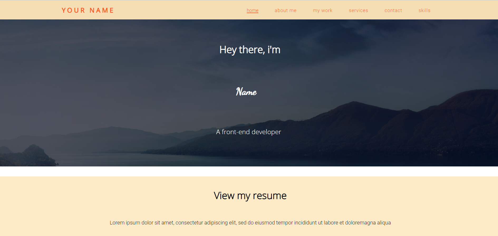
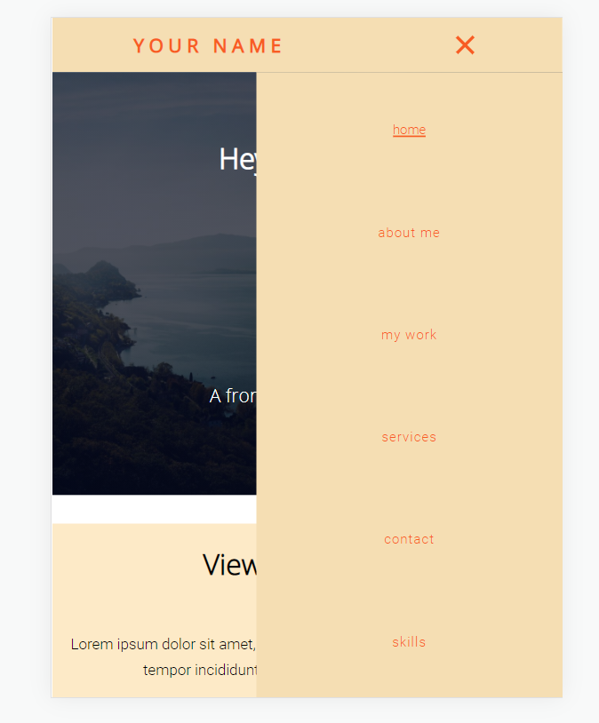
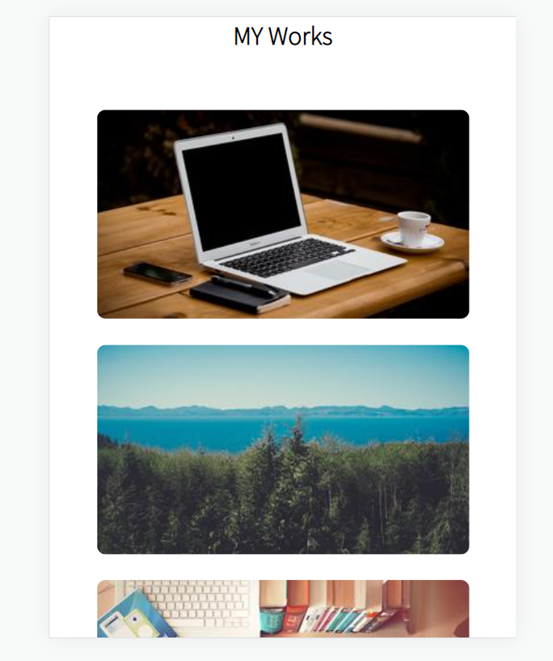
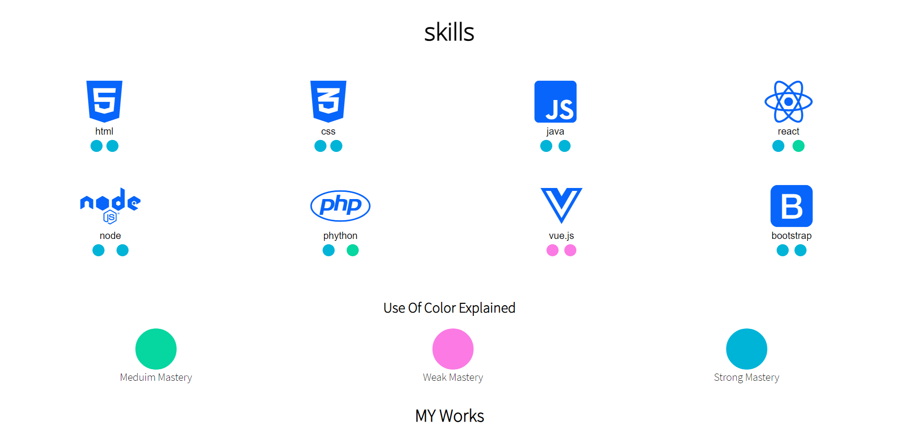
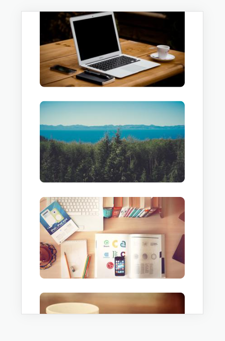
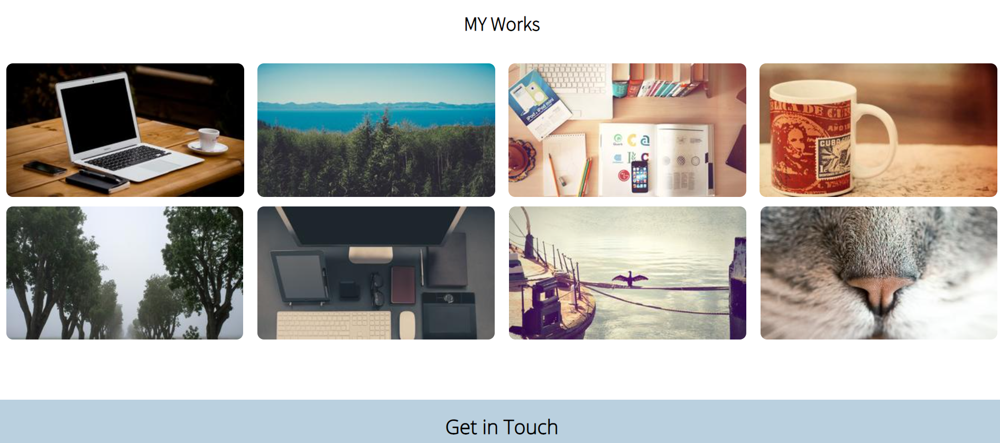
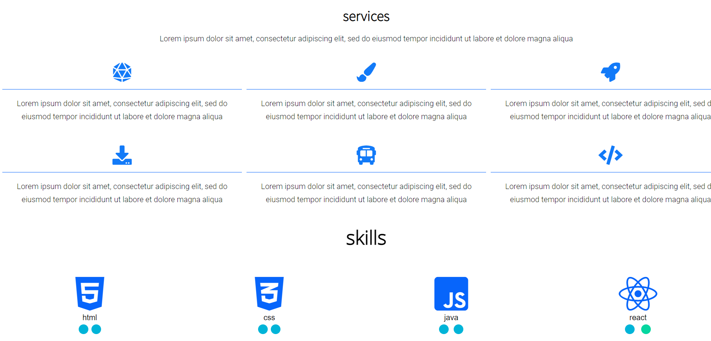

 ## Creating a Portfolio Website 2.

 # Welcome!

 Thankyou for checking this piece of work. 

 ##ABOUT THIS WORK:
This work is done for the basic practise of html, css and java-script. I used html(Hypertext mark-up language) for the structure of the design, and css(cascading style sheet) for implementing design and additional layouts for the already inserted html mark-up., and i used js(java-script) for the insertion of nav-bar functions.

 ## pictures, of our work;
 
            
   ##process##           
            THIS FILE IS FOR PRACTISE OF BASIC HTML
            
         OVERVIEW(/.html/)
         - PRACTISE DESIGNING OF LAYOUT'S INFORM OF SEMANTIC DISPLAYS(SECTIONS, DIV'S, SPAN etc.)
         - PRACTISE HOW TO USE THE CREATE A BASIC HTML FORM STRUCTURE 

                                          
         
          OVERVIEW(/.css/)
         - PRACTISE MAKING USE OF DISPLAY AND THE POSITION PROPERTY
         - PRACTISE HOW TO USE THE GRID SYSTEM AND UTILITIES
         - THE USE OF LINK TAGS
         - PRACTISED HOW TO DESIGN BASIC FORMS WITH LITTLE VALIDATIONS
         - THE STYLING OF BUTTONS AND BRINGING OUT COLORFUL HOVER EFFECTS

## checkout our differrent screen sizes         
##large size

     

  

##smaler size

  

## checkout our display patterns

##GRIDS

 

  

   ## Built with         
      -HTML(Hypertext Mark-up Language)
      -CSS(Cascading Styles Sheet)
      -JS(Java-script)

   ## My Challanges and lessons
  Learnt how to display elements with proper grid systems and making them responsive on mobile view, and also the nav-bar functioned by js was quite interseting with little          defects at the beginning due to wrong assignment of classes to the functions.
            
   ## Installations
   -For those Farmiliar with Git-hub you can clone the repo and pull to your local workplace to view.
   -For those who want to view you can download the file from here [https://affectionate-villani-4ee7d9.netlify.app/], to view Thank you once again.
            

   ## Resources that helped ##
   -For the Colors[https://coolors.co/palettes/trending/blue]
   
   -for the fontfamily[https://fonts.google.com/]
   
   ## Best syntax Used

    ``CSS
 (Flex-box terminologies and Grid systems)
Both Justify and alligned items center were super useful, in addition to the use of grids.
   ``
   
   ## Licsense 
   This work is under [MIT] liscence. It's highly free and opensource to anyone.This work was gotten from #DevProjects -[https://www.codementor.io/projects], click to view cool challanges.
   Thank you once again.
